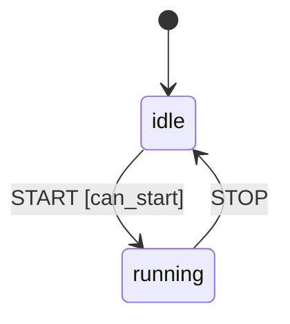

# statem

**A minimal async state machine engine for Python, built on [Pydantic](https://docs.pydantic.dev/).**
The state graph is a validated dict; guards and actions are plain Python (sync or async)
functions, registered by name.

[](https://github.com/RahulDas-dev/statem/actions/workflows/ci.yml)
[](https://rahuldas-dev.github.io/statem/)
[](https://pypi.org/project/statem/)
[](https://pypi.org/project/statem/)
[](https://github.com/RahulDas-dev/statem)
[](../LICENSE)

Full documentation: **<https://rahuldas-dev.github.io/statem/>**

**[Install](#install) · [Quickstart](#quickstart) · [Hooks](#hooks) · [Visualizing](#visualizing) · [Why it's built this way](#why-its-built-this-way) · [Development](#development) · [License](#license)**

## Install

```bash
pip install statem
```

The importable package is `statem`:

```python
from statem import StateMachine, Signal
```

## Quickstart

```python
import asyncio
from statem import Signal, StateMachine

config = {
    "idle": {"on": {"START": {"target": "running", "guard": "can_start"}}},
    "running": {"on": {"STOP": "idle"}},
}


def can_start(ctx, signal) -> bool:
    return True


async def main() -> None:
    machine = StateMachine.from_dict(config, guard_dict={"can_start": can_start})
    state = await machine.run(state_name="idle", events=Signal(event="START"), session={})
    print(state)  # "running"


asyncio.run(main())
```

See [`examples/bread.py`](examples/bread.py) for a fuller example (guards,
actions, `error_state`, and an `always`-transition), or
[`examples/bank.py`](examples/bank.py) for a richer one that exercises
every hook in one conversation, including `error_state` recovering from a real exception. The
[guide](https://rahuldas-dev.github.io/statem/guide/) covers the full config shape.

## Hooks

Four lifecycle hooks can carry guards and/or actions on any state:

| Hook | Fires when | Carries |
|---|---|---|
| `on` | An external `Signal` (event) matches this state's `on` map (or its `"*"` wildcard) | Candidates tried in order: `guard` (optional, must return `bool`) gates the candidate; its `actions` run if it fires |
| `always` | Right after *any* state entry, including the initial one — no external signal needed | Same shape as `on`, minus the event name; used to auto-advance once a condition becomes true |
| `entry` | A state is entered (after the firing transition's own `actions`) | Action names only |
| `exit` | A state is left, before entering the next one | Action names only |

A fifth field, `error_state`, isn't a hook itself but a per-state escape hatch: if an
`on`-transition's action raises, the engine catches it and — if `error_state` is set — transitions
there instead of propagating.

## Visualizing

`to_mermaid(machine, initial=None)` renders `machine.config` as a Mermaid `stateDiagram-v2`
string — no extra dependency, just text. GitHub, MkDocs, VS Code, and Jupyter all render it
natively:

```python
from statem import to_mermaid

print(to_mermaid(machine, initial="idle"))
```



See the [guide](https://rahuldas-dev.github.io/statem/guide/#visualizing-the-graph) for guard
chains, `always`, and `error_state` rendering.

## Why it's built this way

- **Data and behavior stay apart.** `config` is a plain, JSON/YAML-friendly dict — author it by
  hand, generate it, or load it from a file/database/LLM. Guards and actions are ordinary
  functions registered by name, independent of the graph.
- **Fails fast.** Bad transition targets and unregistered guard/action names raise at
  construction time, not three hops into a live run.
- **Sync or async, your choice.** The engine detects and awaits either correctly — no need to
  wrap trivial sync logic in `async def`.
- **`session` is yours.** Any shape you want (dict, dataclass, ORM row) — the engine never
  inspects it, just threads it through to your guards/actions via `ctx.session`.
- **No subclassing.** `StateMachine.from_dict(...)` + `await machine.run(...)`. No framework
  lifecycle to inherit into.
- **Every run is traceable.** Each guard/action fired is recorded in order; a `run_id` (yours, or
  auto-generated) ties every log line from one run together.

## Development

```bash
uv sync
uv run python -m unittest discover -s tests
uv run coverage run -m unittest discover -s tests && uv run coverage report --fail-under=100
uv run ruff check tests statem
```

## License

MIT — see [LICENSE](../LICENSE).
