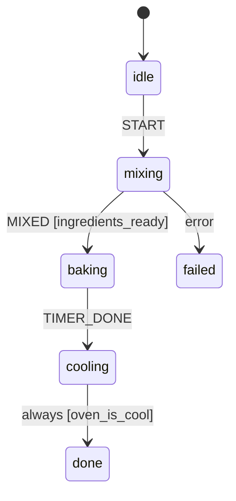
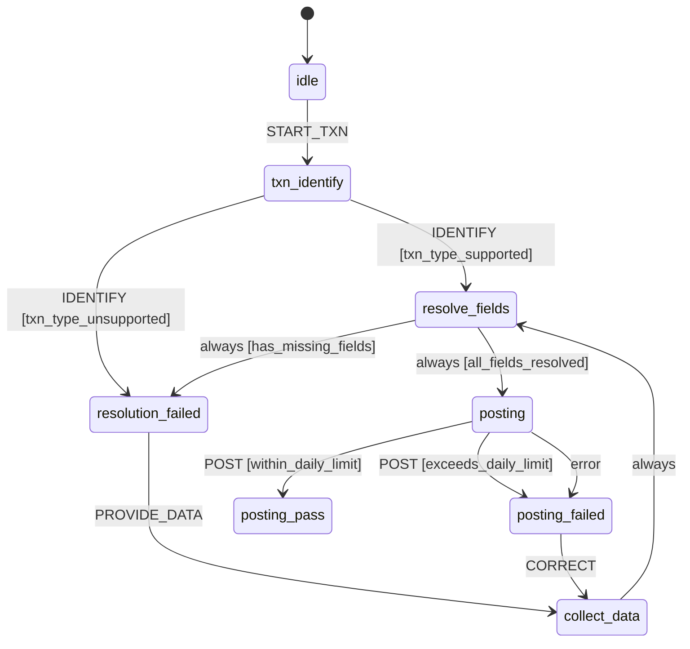

# Examples

Two runnable, fully-tested example scripts live in
[`examples/`](https://github.com/RahulDas-dev/statem/tree/main/examples) in the repository. Both
are shown in full below, kept in sync automatically with the actual source files.

## Bakery process (`examples/bread.py`)

A small bakery process (`idle → mixing → baking → cooling → done`) that exercises guards,
actions, an `error_state` fallback, and an `always`-transition that auto-advances
`cooling → done` once the oven has cooled — all triggered by a single `TIMER_DONE` signal.

Its graph, rendered with [`to_mermaid`](api.md#statem.to_mermaid):



```bash
uv run python examples/bread.py
```

```python
--8 < --"examples/bread.py"
```

## Bank teller bot (`examples/bank.py`)

A richer example: a bank teller's transaction-posting bot that exercises every hook in one
conversation — `on` guard chains (a two-candidate check for supported vs. unsupported
transaction types), a multi-hop `always` cascade (missing fields loop back to ask the teller,
then re-resolve), and `error_state` recovering from a real exception raised inside an async
action (a simulated ledger call), followed by a correction and retry.

Its graph shows both failure mechanisms side by side -- `POST`'s guard chain rejecting
over-the-limit amounts up front, and the separate `error`-labeled edge from `error_state`
catching the ledger call's exception:



```bash
uv run python examples/bank.py
```

```python
--8 < --"examples/bank.py"
```
