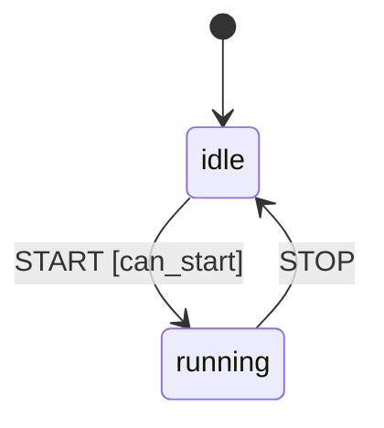

# Guide

## Config shape

`StateMachine.from_dict(config, action_dict=None, guard_dict=None)` takes a plain dict mapping
state name → state config. Each state config accepts:

| Field | Meaning |
|---|---|
| `on` | `{event_name: transition(s)}` — candidates tried in order; the first whose guard passes fires. |
| `always` | Eventless transition candidates, re-checked after every state entry. |
| `entry` | Action names to run when the state is entered. |
| `exit` | Action names to run when the state is left. |
| `error_state` | Fallback state to enter if an `on`-transition's action raises. |

A transition candidate is `{"target": ..., "guard": ... (optional), "actions": [...] (optional)}`.
Shorthand is normalized automatically:

```python
"on": {"START": "running"}                                    # -> target only
"on": {"START": {"target": "running", "guard": "can_start"}}   # -> single dict
"on": {"START": ["blocked", {"target": "running", "guard": "g"}]}  # -> list of candidates
```

`"*"` is a wildcard event — used when no exact event match exists for the current state.

Config is validated eagerly: unknown transition targets (in `on`, `always`, or `error_state`)
raise at construction time, and if `action_dict`/`guard_dict` are supplied, every referenced
guard/action name must be registered too.

## Guards and actions

Both are plain Python callables — sync or async — taking `(ctx, signal)`:

```python
def can_start(ctx, signal) -> bool: ...  # guards must return bool
async def create_order(ctx, signal) -> None: ...  # actions may return anything (or nothing)
```

Register them via `from_dict(config, action_dict={...}, guard_dict={...})`, or later through
`machine.actions.register(name, fn)` / `machine.guards.register(name, fn)`, followed by
`machine.validate_registries()` to check for typos (raises `ValueError` listing anything missing).

## Running the machine

```python
state = await machine.run(run_id=None, state_name=state_name, events=events, session=session)
```

All arguments are keyword-only.

- `run_id` — an optional correlation id used in log lines (`run_id=... | state=... | ...`).
  If not provided (left as `None`), a `uuid4().hex` string is generated automatically.
- `events` — a single `Signal`, a list of `Signal`s, or `[]` to only resolve pending
  `always`-transitions for the current state.
- `session` — **any object you want.** The engine never inspects or mutates its shape; it's
  simply attached to the per-run `Context` (`ctx.session`) so your guards/actions can
  read and mutate whatever they need.
- Returns the final state name once every signal has been processed and all pending
  `always`-transitions have settled.

## `always`-transitions

After every state entry (including the initial state, before any signal is processed), the
engine checks that state's `always` list. If a guard passes, its actions run, the machine enters
the target, and the check repeats from there — so one `run()` call can auto-advance through
several states in a row. If no guard passes, nothing happens. This loop is capped at 100 hops; an
`always` chain that never settles raises `RuntimeError`.

## `error_state` fallback

If an `on`-transition's action raises, the engine wraps it as `TransitionError`. If the current
state declares `error_state`, the machine transitions there instead of raising (a warning is
logged); otherwise the `TransitionError` propagates to the caller.

## Tracing a run

Every guard/action evaluated during a `run()` call is recorded, in order, on
`ctx.results` (a list of `ResultEntry`). [`show_transitions(ctx)`](api.md#statem.show_transitions)
renders that trace as a readable hop-by-hop report — useful for debugging why a machine ended up
where it did. Note `run()` itself only returns the final state name; to inspect the trace, work
with a `Context` directly (as the test suite does) or rely on the `run_id`-tagged log
output.

## Visualizing the graph

[`to_mermaid(machine, initial=None)`](api.md#statem.to_mermaid) walks `machine.config` and returns
a Mermaid `stateDiagram-v2` diagram source string — pure text, no extra dependency. Paste the
result into a ` ```mermaid ` fence and it renders natively in GitHub READMEs, MkDocs Material
(including this site), VS Code, and Jupyter.

```python
from statem import StateMachine, to_mermaid

config = {
    "idle": {"on": {"START": {"target": "running", "guard": "can_start"}}},
    "running": {"on": {"STOP": "idle"}},
}
machine = StateMachine.from_dict(config, guard_dict={"can_start": lambda ctx, signal: True})
print(to_mermaid(machine, initial="idle"))
```

Output:

```text
stateDiagram-v2
    [*] --> idle
    idle --> running: START [can_start]
    running --> idle: STOP
```

Which renders as:



A guard-chain (multiple candidates for one event) produces multiple labeled edges from the same
state, and `always`/`error_state` get their own `always`/`error`-labeled edges — see the
[bank teller bot](examples.md#bank-teller-bot-examplesbankpy) for a richer diagram that shows all
of this at once. `initial`, if given and present in `config`, prepends a `[*] --> initial` edge;
`StateMachine` itself has no notion of an initial state (that's chosen fresh by the caller on
every `run()` call), so it's opt-in.

## Further reading

The [API Reference](api.md) documents every public class and function directly from source.
