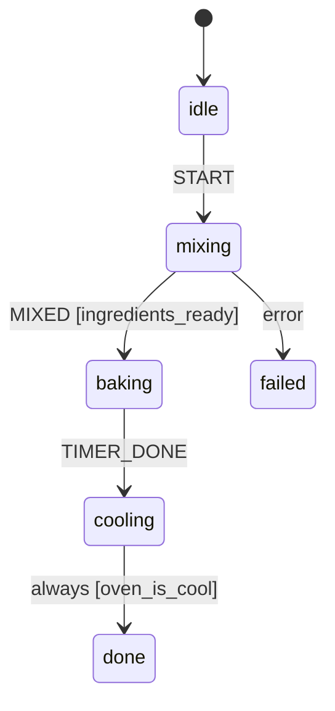
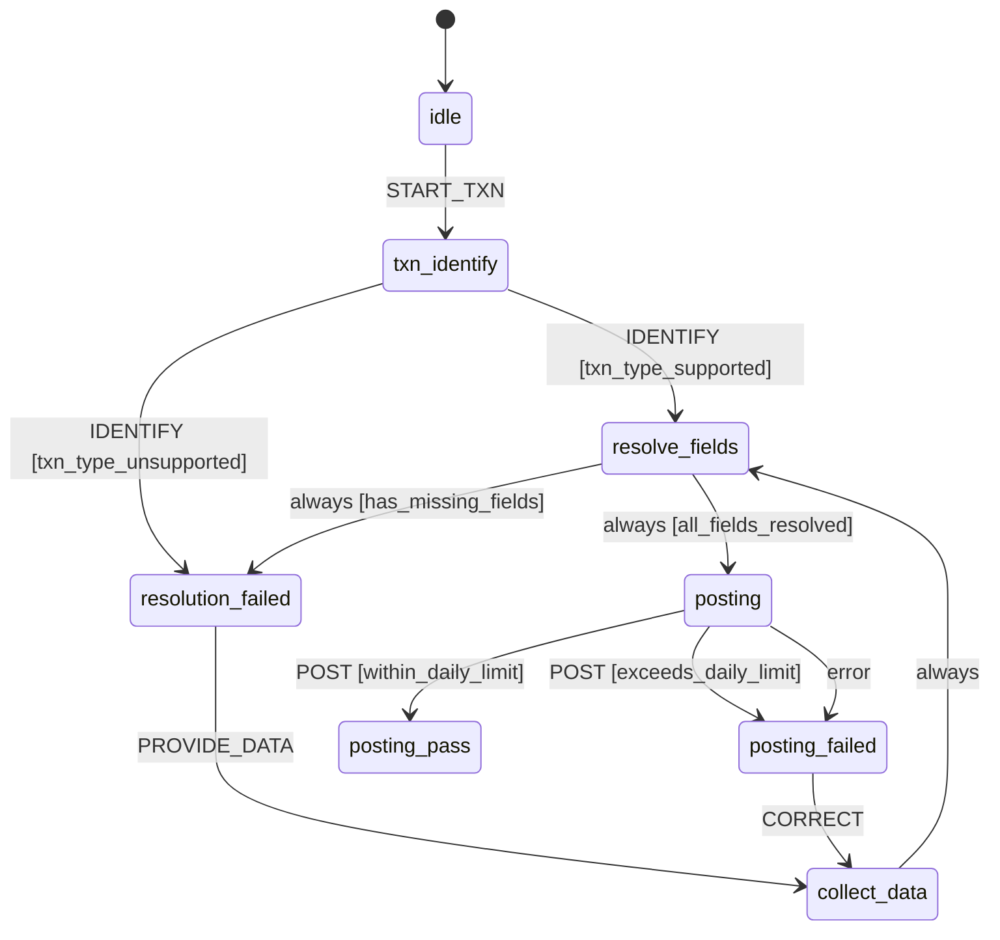
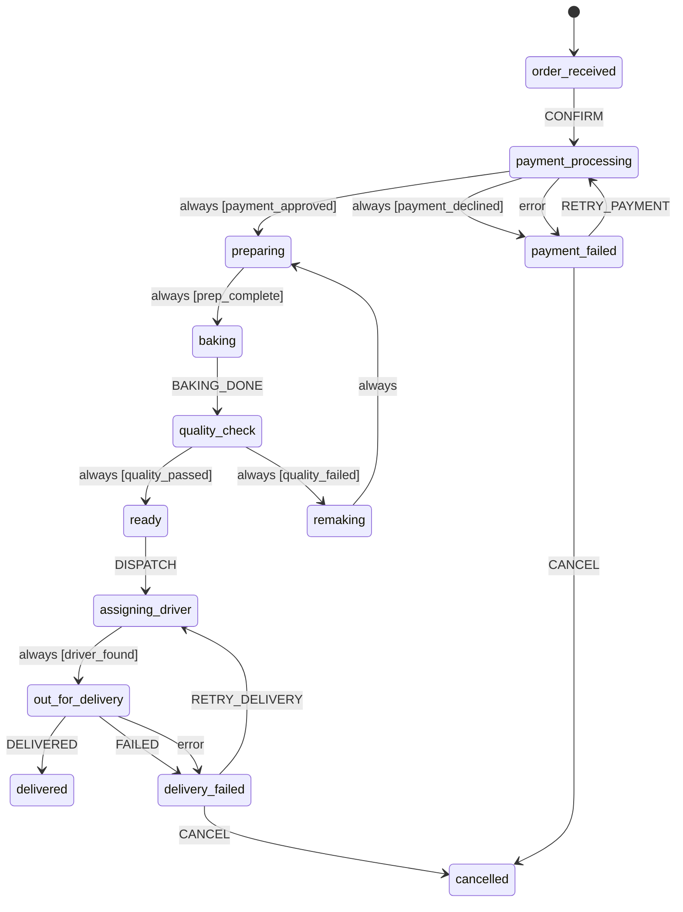

# Examples

Three runnable, fully-tested example scripts live in
[`examples/`](https://github.com/RahulDas-dev/statem/tree/main/examples) in the repository. All
are shown in full below, kept in sync automatically with the actual source files.

## Bakery process (`examples/bread.py`)

A small bakery process (`idle → mixing → baking → cooling → done`) that exercises guards,
actions, an `error_state` fallback, and an `always`-transition that auto-advances
`cooling → done` once the oven has cooled — all triggered by a single `TIMER_DONE` signal.

Its graph, rendered with {py:func}`to_mermaid <statem.to_mermaid>`:



```bash
uv run python examples/bread.py
```

```{literalinclude} ../examples/bread.py
:language: python
```

## Bank teller bot (`examples/bank.py`)

A richer example: a bank teller's transaction-posting bot that exercises every hook in one
conversation — `on` guard chains (a two-candidate check for supported vs. unsupported
transaction types), a multi-hop `always` cascade (missing fields loop back to ask the teller,
then re-resolve), and `error_state` recovering from a real exception raised inside an async
action (a simulated ledger call), followed by a correction and retry.

Its graph shows both failure mechanisms side by side -- `POST`'s guard chain rejecting
over-the-limit amounts up front, and the separate `error`-labeled edge from `error_state`
catching the ledger call's exception:



```bash
uv run python examples/bank.py
```

```{literalinclude} ../examples/bank.py
:language: python
```

## Pizza order bot (`examples/pizza.py`, streaming)

The largest example: an order-to-delivery pizza bot (payment, quality-check retries, delivery
retries, `CANCEL` escape hatches at multiple points) that also demonstrates
[`stream()`](streaming.md) — `run_streaming_demo()` drives one signal through the machine and
prints the raw AG-UI event sequence (`STEP_STARTED`, `STATE_SNAPSHOT`, `ACTIVITY_SNAPSHOT`,
`STATE_DELTA`, `STEP_FINISHED`) as it happens, alongside two plain `run()` demos for comparison.
Requires the `agui` extra (`pip install statem[agui]`) for the streaming portion only.



```bash
uv run python examples/pizza.py
```

```{literalinclude} ../examples/pizza.py
:language: python
```
